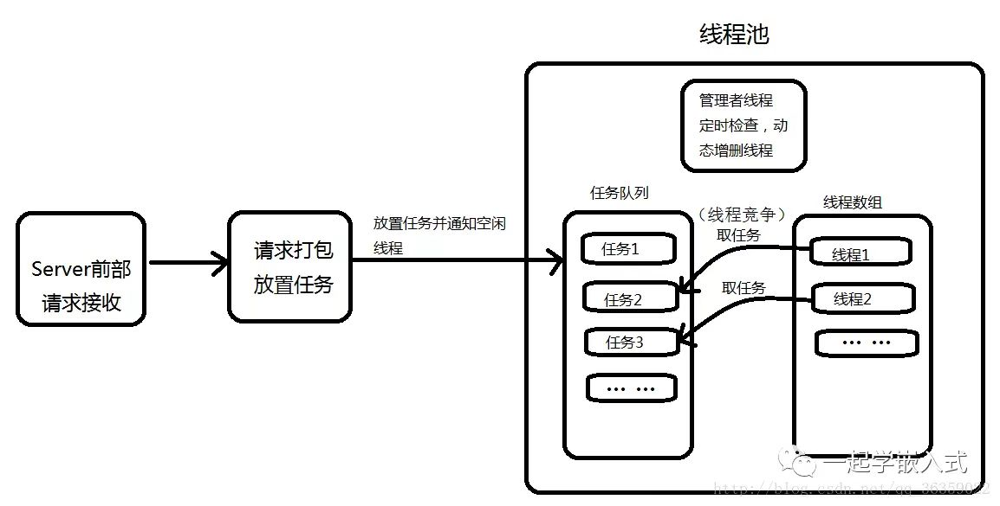

# 基于Posix标准下的pthread库编写的threadpool

## why threadpool?

在Unix网络编程中，线程与进程用于处理各项分支子功能，我们通常的操作是：

接收消息 ==> 消息分类 ==> 线程创建 ==> 传递消息到子线程 ==> 线程分离 ==> 在子线程中执行任务 ==> 任务结束退出。

对大多数小型局域网的通信来说，上述方法足够满足需求。

> 但当我们的通信范围扩大到广域网或大型局域网通信中时，我们将面临大量消息频繁请求服务器。在这种情况下，创建与销毁线程都已经成为一种奢侈的开销，特别对于嵌入式服务器来说更应保证内存资源的合理利用。
>
> 因此，线程池技术应运而生；线程池允许一个线程可以多次复用，且每次复用的线程内部的消息处理可以不相同，将创建与销毁的开销省去，而不必来一个请求开一个线程；

## what threadpool?

线程池是一种多线程处理形式，大多用于高并发服务器上，它能合理有效地利用高并发服务器上的线程资源。

线程池是一个抽象的概念，其内部由`任务队列`，`一堆线程`，`管理者线程`组成:




## How threadpool?

这里我们使用基于Posix标准实现的pthread线程库来实现一个线程池。

* 需要定义一个结构体`threadpool_task_t`来描述`任务`这一概念。

  ```cpp
  typedef struct {
      void* (*function)  (void*);
      void* arg;
  }threadpool_task_t;
  ```

  

* 需要定义一个结构体`threadpool_t`来表示`线程池`

  ```cpp
  /*线程池管理*/
  struct threadpool_t
  {
     pthread_mutex_t lock;                 /* 锁住整个结构体 */
     pthread_mutex_t thread_counter;       /* 用于使用忙线程数时的锁 */
     pthread_cond_t  queue_not_full;       /* 条件变量，任务队列不为满 */
     pthread_cond_t  queue_not_empty;      /* 任务队列不为空 */
  
     pthread_t *threads;                   /* 存放线程的tid,实际上就是管理了线 数组 */
     pthread_t admin_tid;                  /* 管理者线程tid */
     threadpool_task_t *task_queue;        /* 任务队列 */
  
     /*线程池信息*/
     int min_thr_num;                      /* 线程池中最小线程数 */
     int max_thr_num;                      /* 线程池中最大线程数 */
     int live_thr_num;                     /* 线程池中存活的线程数 */
     int busy_thr_num;                     /* 忙线程，正在工作的线程 */
     int wait_exit_thr_num;                /* 需要销毁的线程数 */
  
     /*任务队列信息*/
     int queue_front;                      /* 队头 */
     int queue_rear;                       /* 队尾 */
     int queue_size; 
  
     /* 存在的任务数 */
     int queue_max_size;                   /* 队列能容纳的最大任务数 */
     /*线程池状态*/
     int shutdown;                         /* true为关闭 */
  };
  ```

* 需要一个创建线程池的函数`threadpool_create()`，他返回一个指向所创建线程池的指针（堆区分配的，所有有效）

  ```cpp
  struct threadpool_t* threadpool_create(int min_thr_num, int max_thr_num, int queue_max_size);
  ```

* 需要一个工作线程处理任务的函数`threadpool_thread()`，该函数作为线程池中每个所创建线程的`pthread_create()`的第三个参数，即线程的主函数（线程去执行）。

  ```cpp
  void threadpool_thread(void* threadpool);
  ```

* 需要一个向任务队列中添加任务的函数`threadpool_add_task`。

  ```cpp
  int threadpool_add_task(threadpool_t* pool, void* (*function)(void* arg), void* arg);
  ```

* 需要一个管理者线程管理线程池的函数`admin_thread(void* threadpool)`，该函数作为管理者线程的主函数。

  ```cpp
  void* admin_thread(void* threadpool);
  ```

* 需要一个释放线程池资源的函数`threadpool_free`以及一个销毁线程池的函数`threadpool_destroy`

  ```cpp
  int threadpool_free(threadpool_t* pool);
  int threadpool_destroy(threadpool_t* pool);
  ```

  


## pthread库相关函数

```cpp
pthread_create();
pthread_join();
pthread_detach();
pthread_kill();//用于向指定线程发送信号，并不是用来杀死线程的
pthread_exit();
    
pthread_mutex_init();
pthread_mutex_lock();
pthread_mutex_unlock();
pthread_mutex_destroy();

pthread_cond_init();
pthread_cond_wait();//使线程因为因某事件阻塞
pthread_cond_broadcast();//唤醒所有正在等待某事件的线程
pthread_cond_signal();//唤醒至少一个正在等待某事件的线程
```

